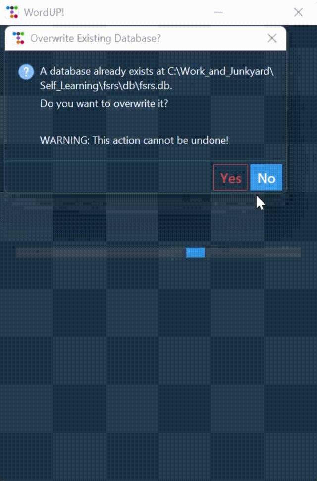
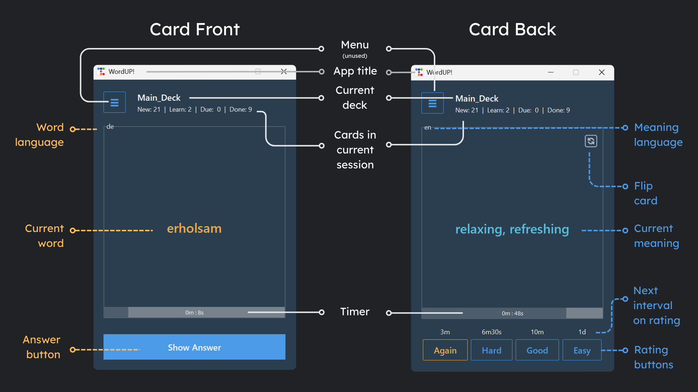

<h1>WordUP! An FSRS-based Flashcard App for Learning German Vocabulary (Level: B1, Source: Netzwerk B1-Glossary)</h1>

<h2>Overview</h2>
FSRS (Free Spaced-Repetition Scheduling) is a scheduling algorithm designed to ensure maximum learning efficiency (high retention, low effort).
The algorithm is used in popular learning apps like Anki and RemNote, and is demonstrably as efficient as the heavily researched algorithm family SuperMemo (SM).
  
To learn more about FSRS, please refer to the README of the github repository for fsrs4anki.
 
Project link: https://github.com/open-spaced-repetition/fsrs4anki

<h2>Why I created WordUP!</h2>
WordUP! is a python project created as a hands-on project to learn Python, but also something that had use in my personal life.
Since it's a project that I used to _learn_ python, the code isn't always very "Pythonic". But it definitely gets the job done when it comes to learning German vocabulary.
  
In other words, <i>I optimized my learning by building something to learn with, while learning how to build something to optimize language-learning with</i> :smile:
  
The words were extracted from Netzwerk's B1-Glossary (Kapitelwortschatz). This links WordUP! to one of my earlier python projects for text extraction.
 
Project link: https://github.com/snoozy10/netzwerk_glossary_extractor

<h2>How it works</h2>

  

<h2>What it means</h2>

  

